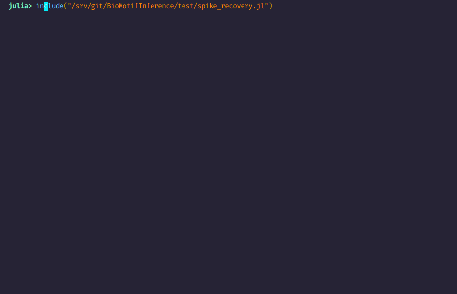

# BioMotifInference
[](https://travis-ci.org/mmattocks/BioMotifInference.jl)
[](https://codecov.io/gh/mmattocks/BioMotifInference.jl)
[](https://www.repostatus.org/#inactive)

BioMotifInference.jl implements nested sampling of ensembles of Independent Component Analysis (ICA) models. These are composed of Position Weight Matrix (PWM) DNA motif signals emitting on a background Hidden Markov Model of genomic noise (BHMM). It is intended for Distributed.jl cluster use, although smaller problems can be solved on one machine. BHMMs can be trained using [BioBackgroundModels.jl](https://github.com/mmattocks/BioBackgroundModels.jl). BioMotifInference.jl is similar to nMICA, implemented by Down and Hubbard in Java in 2004 (Down, T. A., and Tim J.P. Hubbard. “NestedMICA: Sensitive Inference of over-Represented Motifs in Nucleic Acid Sequence.” Nucleic Acids Research 33, no. 5 (March 8, 2005): 1445–53. https://doi.org/10.1093/nar/gki282.
).

# Installation

Add the github url using the Julia package manager:

```
julia>]add https://github.com/mmattocks/BioMotifInference.jl
```

# Example use

A synthetic example, using observations generated from a background model of _D. rerio_ intergenic sequences, with both a periodic CTC motif and an irregular, but recurring TATAWAW box spiked in, can be found in tests/spike recovery.jl.

'''
include(dirname(dirname(pathof(BioMotifInference)))*"/test/spike_recovery.jl")
'''

Output:



# Documentation
More extensive documentation is available [here](https://github.com/mmattocks/Thesis/blob/master/chapters/PTII/BMI.tex).